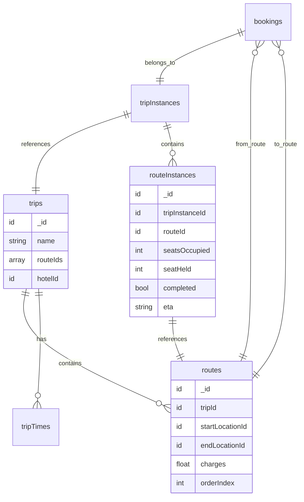

# Route-based Multi-Stop Booking System

## Problem Statement

Currently, trips have only 2 locations (source -> destination). When multiple trips exist (H->C, H->A) in the same time slot, they each get full shuttle capacity (12 + 12 = 24 seats), which is incorrect since the same shuttle serves all routes.

## Solution Architecture




## Seat Calculation Example

Trip: H->C->X->A (Shuttle capacity: 12)| Booking | From | To | Segments Used ||---------|------|----|--------------|| B1 | H | C | [H->C] || B2 | H | A | [H->C, C->X, X->A] || B3 | C | X | [C->X] |Seat occupancy at each segment:

- **H->C**: B1(2) + B2(5) = 7 seats
- **C->X**: B2(5) + B3(7) = 12 seats (at capacity!)
- **X->A**: B2(5) = 5 seats

Validation: If someone tries to book C->X with 1 seat, REJECT (would exceed 12).---

## Part 1: Schema Changes

### 1.1 New `routes` Table

```typescript
routes: defineTable({
  tripId: v.id("trips"),
  startLocationId: v.id("locations"),
  endLocationId: v.id("locations"),
  charges: v.float64(),
  orderIndex: v.int64(), // 0, 1, 2... for ordering
})
  .index("by_trip", ["tripId"])
  .index("by_trip_order", ["tripId", "orderIndex"])
```


### 1.2 Update `trips` Table

Remove: `sourceLocationId`, `destinationLocationId`, `charges`Add: `routeIds: v.array(v.id("routes"))` (ordered)

### 1.3 New `routeInstances` Table

```typescript
routeInstances: defineTable({
  tripInstanceId: v.id("tripInstances"),
  routeId: v.id("routes"),
  orderIndex: v.int64(),
  seatsOccupied: v.int64(),
  seatHeld: v.int64(),
  completed: v.boolean(),
  eta: v.optional(v.string()),
})
  .index("by_trip_instance", ["tripInstanceId"])
  .index("by_trip_instance_order", ["tripInstanceId", "orderIndex"])
  .index("by_route", ["routeId"])
```


### 1.4 Update `tripInstances` Table

Remove: `seatsOccupied`, `seatHeld`, `eta` (moved to routeInstances)Keep: everything else

### 1.5 Update `bookings` Table

Add:

```typescript
fromRouteIndex: v.int64(),  // Index of first route segment
toRouteIndex: v.int64(),    // Index of last route segment (inclusive)
```

---

## Part 2: Core Functions

### 2.1 Route Segment Resolution

**File:** `convex/lib/routeUtils.ts` (NEW)| Function | Input | Output | Purpose ||----------|-------|--------|---------|| `getRouteSegmentsForBooking` | tripId, fromLocationId, toLocationId | { fromIndex, toIndex, routes[] } | Find which route segments a booking covers || `calculateTotalCharges` | routes[], fromIndex, toIndex | number | Sum charges for segments traveled || `validateLocationsOnTrip` | tripId, fromLocationId, toLocationId | boolean | Check if from/to are valid stops on trip |

### 2.2 Seat Availability (Critical)

**File:** `convex/lib/seatCalculator.ts` (NEW)| Function | Input | Output | Purpose ||----------|-------|--------|---------|| `getMaxAvailableSeats` | tripInstanceId, fromIndex, toIndex | number | Find minimum available seats across all route segments || `validateSeatAvailability` | tripInstanceId, fromIndex, toIndex, requiredSeats | { valid, reason } | Check if booking is possible || `calculateSegmentOccupancy` | tripInstanceId | Map<routeIndex, { occupied, held }> | Get occupancy for all segments |**Algorithm for seat validation:**

```javascript
FOR each routeIndex from fromIndex to toIndex:
    routeInstance = getRouteInstance(tripInstanceId, routeIndex)
    usedSeats = routeInstance.seatsOccupied + routeInstance.seatHeld
    availableSeats = shuttleCapacity - usedSeats
    IF availableSeats < requiredSeats:
        RETURN { valid: false, reason: "Segment X->Y is at capacity" }
RETURN { valid: true }
```


### 2.3 Updated Booking Flow

**File:** `convex/bookings/index.ts`Update `createBooking` mutation:

1. Resolve fromLocationId/toLocationId to route indices
2. Validate all route segments have capacity
3. Create booking with fromRouteIndex/toRouteIndex
4. Increment seatHeld on ALL routeInstances from fromIndex to toIndex

### 2.4 RouteInstance Management

**File:** `convex/routeInstances/mutations.ts` (NEW)| Function | Input | Output | Purpose ||----------|-------|--------|---------|| `createRouteInstancesForTripInstance` | tripInstanceId, tripId | void | Create routeInstance for each route in trip || `updateRouteInstanceSeats` | routeInstanceId, heldDelta, occupiedDelta | void | Update seat counts || `completeRouteInstance` | routeInstanceId, driverId | void | Mark route as completed, release seats || `updateRouteInstanceETA` | routeInstanceId, eta | void | Update ETA for route |

### 2.5 Confirm/Reject Booking Updates

**File:** `convex/bookings/index.ts`Update `confirmBooking`:

- Move seats from held to occupied on ALL routeInstances (fromIndex to toIndex)

Update `rejectBooking`:

- Release held seats on ALL routeInstances (fromIndex to toIndex)

### 2.6 Driver Route Completion

**File:** `convex/routeInstances/mutations.ts`When driver marks a route segment as completed:

1. Set `completed: true` on routeInstance
2. Release `seatsOccupied` for bookings that end at this route
3. Update priority for remaining routes

### 2.7 ETA Calculation

**File:** `convex/routeInstances/mutations.tsupdateETAForInProgressTrip`:

- Only update ETA for routeInstances where `completed: false`
- Get driver location from shuttle.currentlyAssignedTo user
- Calculate ETA from driver location to each incomplete route's destination

---

## Part 3: Updated SlotFinder

**File:** `convex/lib/slotFinder.ts`Update `checkSlotAvailability`:

- Instead of checking flat seatsOccupied/seatHeld on tripInstance
- Check maximum occupancy across all route segments
- A slot is available only if ALL segments have capacity

---

## Part 4: Trip/Route CRUD

### 4.1 Create Trip with Routes

**File:** `convex/trips/index.ts`Update `createTrip` action:

- Accept array of locations instead of source/destination
- Create route for each consecutive pair
- Store routeIds in trip

### 4.2 Update Trip

- Handle route additions/removals
- Validate no active tripInstances exist before modifying routes

### 4.3 Delete Trip

- Cascade delete routes
- Validate no active bookings

---

## Part 5: Frontend Updates

### 5.1 Booking Form

**File:** `components/interfaces/guest/booking/transfer-form.tsx`

- Show all stops on the trip as selectable from/to options
- Calculate and display price based on segments
- Show available seats (minimum across segments)

### 5.2 Admin Trip Form

**File:** `components/interfaces/admin/trips/edit-trip-form.tsx`

- Allow adding multiple stops (drag-drop reorder)
- Set charges per route segment
- Validate at least 2 locations

### 5.3 Driver Route Progress

**File:** `components/interfaces/driver/trip-instance-detail.tsx`

- Show route segments with completion status
- Allow marking individual routes as completed
- Show ETA per route segment