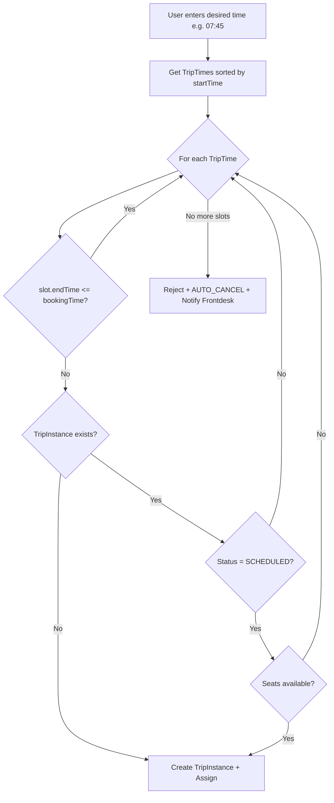

# Smart Slot Booking Logic

## Current Problem

The current implementation requires frontend to pass exact `scheduledStartTime` and `scheduledEndTime`. It validates against TripTimes but doesn't automatically find the next available slot when the requested one is unavailable.

## Solution Architecture




## Files to Modify

### 1. New Helper: Find Best Available Slot

**File:** [convex/lib/slotFinder.ts](convex/lib/slotFinder.ts) (NEW)Create a helper function that encapsulates the slot-finding logic:

```typescript
interface SlotResult {
  tripTimeId: Id<"tripTimes">;
  startTime: string;
  endTime: string;
  shuttleId: Id<"shuttles"> | null;
  existingTripInstanceId?: Id<"tripInstances">;
  reason?: string;
}

async function findBestAvailableSlot(
  ctx,
  tripId,
  hotelId,
  scheduledDate,
  desiredTime,
  requiredSeats
): Promise<SlotResult | null>
```


### 2. Update Booking API Args

**File:** [convex/bookings/index.ts](convex/bookings/index.ts)Change `createBooking` mutation args:

- Remove: `scheduledStartTime`, `scheduledEndTime`
- Add: `desiredTime` (string, e.g., "07:45")

The mutation will:

1. Call `findBestAvailableSlot()` to get the best slot
2. If slot found: create booking with that slot's times
3. If no slot: create REJECTED booking with AUTO_CANCEL

### 3. Update Shuttle Query

**File:** [convex/shuttles/queries.ts](convex/shuttles/queries.ts)Modify `getAvailableShuttle` to be called per-slot from the slot finder, or create a new internal query `getShuttleForSlot` that checks a specific slot's availability.

### 4. Frontend API Route Update

**File:** [app/api/bookings/create/route.ts](app/api/bookings/create/route.ts)Update to pass `desiredTime` instead of start/end times.

### 5. Frontend Booking Form

**File:** [app/(dashboards)/(guest)/new-booking/[slug]/page.tsx](app/(dashboards)/(guest)/new-booking/[slug]/page.tsx)Update form to:

- Accept time input (HH:MM format)
- Send `desiredTime` to API

## Key Implementation Details

### Time Comparison Logic

Times are stored as ISO strings like `"1970-01-01T09:00:00.000Z"`. We need to:

- Extract hours from ISO string: `new Date(isoTime).getUTCHours()`
- Compare only hours (since slots are hourly, no minutes)
- A slot is "ended" if its endTime hour <= desiredTime hour

### Slot Validation Order

```javascript
1. Skip if slot.endTime <= desiredTime (slot already ended)
2. If TripInstance exists for this tripId + date + slot + shuttle:
    - Status = SCHEDULED + seats available -> USE THIS INSTANCE
    - Status = SCHEDULED + full -> try next shuttle, then next slot
    - Status = IN_PROGRESS/COMPLETED/CANCELLED -> try next shuttle, then next slot
3. If no TripInstance exists for this slot -> CREATE new TripInstance + USE
4. No valid slot across all TripTimes -> REJECT with AUTO_CANCEL
```


### TripInstance Uniqueness Rule

Multiple TripInstances CAN exist with same date + time + shuttle IF they have different tripIds:

- **Unique Key:** `tripId + scheduledDate + scheduledStartTime + scheduledEndTime + shuttleId`
- Example: Trip A (Airport to Hotel) and Trip B (Hotel to Airport) can both have TripInstances at 08:00-09:00 on the same shuttle
- The slot finder checks TripInstances filtered by the SPECIFIC tripId being booked

### Detailed Slot Finding Logic

```javascript
FOR each TripTime in trip.tripTimesIds (sorted by startTime):
    IF slot.endTime <= desiredTime:
        SKIP (slot ended)
    
    FOR each active shuttle in hotel:
        tripInstance = query TripInstance WHERE:
                - tripId = booking's tripId (IMPORTANT: filter by tripId)
                - scheduledDate = booking's date
                - startTime = slot.startTime
                - endTime = slot.endTime
                - shuttleId = this shuttle
        
        IF tripInstance NOT EXISTS:
            -> Can CREATE new TripInstance for this slot
            -> Return this slot + shuttle
        
        IF tripInstance.status != "SCHEDULED":
            -> SKIP this shuttle (trip started/completed/cancelled)
            -> Try next shuttle
        
        IF tripInstance.status == "SCHEDULED":
            availableSeats = shuttle.totalSeats - (seatsOccupied + seatHeld)
            IF availableSeats >= requiredSeats:
                -> Return this slot + shuttle + existing tripInstanceId
            ELSE:
                -> SKIP this shuttle (full)
                -> Try next shuttle
    
    (All shuttles exhausted for this slot, try next TripTime)

(All TripTimes exhausted)
-> REJECT booking with AUTO_CANCEL
```


### Auto-Cancel Response

When no slot available, the booking is still created but with:

```typescript
bookingStatus: "REJECTED"
cancelledBy: "AUTO_CANCEL"
cancellationReason: "No shuttle available for the requested time"
```

Plus notification to frontdesk with type `BOOKING_FAILED`.

## Testing Scenarios

| Desired Time | TripTimes | TripInstance Status | Expected Result ||--------------|-----------|---------------------|-----------------|| 07:45 | 07-08, 08-09 | 07-08: COMPLETED | Use 08-09 || 08:10 | 08-09 | None exists | Create 08-09 TripInstance || 08:10 | 08-09 | 08-09: SCHEDULED with seats | Use existing 08-09 || 08:10 | 08-09 | 08-09: IN_PROGRESS | REJECT - no next slot || 08:20 | 08-09, 09-10 | 08-09: IN_PROGRESS | Use 09-10 || 08:30 | 08-09, 10-11 | 08-09: IN_PROGRESS | REJECT - gap, no 09-10 || 08:05 | 08-09 | 08-09: SCHEDULED but FULL | REJECT |

### Multiple Trips Same Slot

Two trips exist:

- Trip A: Airport to Hotel (tripId: abc)
- Trip B: Hotel to Airport (tripId: xyz)

Both have TripTime 08:00-09:00 on the same shuttle.| Booking | TripInstance State | Result ||---------|-------------------|--------|| Trip A at 08:15 | None exist | Create TripInstance for Trip A || Trip B at 08:20 | A: SCHEDULED | Create SEPARATE TripInstance for Trip B || Trip A at 08:30 | A: SCHEDULED full | REJECT Trip A booking |