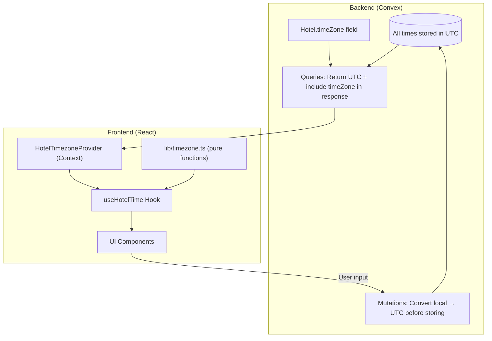

# Timezone Management System

## Architecture Overview




## Data Flow

| Direction | What Happens ||-----------|-------------|| **Frontend → Backend** | User enters time in hotel's local timezone → Convert to UTC → Store in Convex || **Backend → Frontend** | Fetch UTC time from Convex → Convert to hotel timezone → Display to user |---

## Phase 1: Core Infrastructure

### 1.1 Create Timezone Utility Functions

**File:** [`lib/timezone.ts`](lib/timezone.ts) (new file)Pure utility functions for timezone conversions using the `Intl.DateTimeFormat` API (no external libraries needed):

- `toHotelTime(utcDate, timeZone, options)` - Convert UTC to hotel timezone
- `toUTC(localDate, timeZone)` - Convert hotel local time to UTC
- `formatTime(date, timeZone, format)` - Format time (24hr/12hr configurable)
- `formatDate(date, timeZone, format)` - Format date (MM/DD/YYYY default)
- `formatDateTime(date, timeZone, options)` - Combined formatter
- `getTimezoneOffset(timeZone)` - Get offset string like "UTC-5" or "UTC+5:30"
- `getTimezoneAbbr(timeZone)` - Get abbreviation like "EST", "IST"

### 1.2 Create Hotel Timezone Context

**File:** [`lib/provider/hotel-timezone-provider.tsx`](lib/provider/hotel-timezone-provider.tsx) (new file)

```typescript
// For hotel staff (admin, frontdesk, driver) - fetches timezone once based on user's hotelId
// Uses Convex useQuery which handles caching automatically
interface HotelTimezoneContext {
  timeZone: string | null;
  hotelId: Id<"hotels"> | null;
  isLoading: boolean;
}
```


### 1.3 Create useHotelTime Hook

**File:** [`hooks/use-hotel-time.ts`](hooks/use-hotel-time.ts) (new file)

```typescript
// Flexible hook that works for both hotel staff and guests
function useHotelTime(hotelId?: Id<"hotels">) {
  // If hotelId provided: fetch that hotel's timezone (for guests viewing specific booking)
  // If no hotelId: use context timezone (for hotel staff)
  
  return {
    timeZone,
    formatTime: (utcDate, options?) => ...,
    formatDate: (utcDate, options?) => ...,
    formatDateTime: (utcDate, options?) => ...,
    toUTC: (localDate) => ...,
    getOffset: () => ...,  // Returns "UTC-5" etc.
  };
}
```

---

## Phase 2: Backend Audit & Updates

### 2.1 Time Fields in Schema (Reference)

Current time-related fields in [`convex/schema.ts`](convex/schema.ts):| Table | Field | Current Format | Notes ||-------|-------|----------------|-------|| `tripTimes` | `startTime`, `endTime` | ISO string (UTC) | Already UTC || `tripInstances` | `scheduledDate` | YYYY-MM-DD | Date only || `tripInstances` | `scheduledStartTime`, `scheduledEndTime` | ISO string | Already UTC || `tripInstances` | `actualStartTime`, `actualEndTime` | ISO string | Already UTC || `bookings` | `verifiedAt`, `waivedAt` | ISO string | Already UTC || `messages` | `timestamp` | ISO string | Already UTC || `routeInstances` | `eta` | ISO string | Already UTC || `otps` | `expiresAt` | ISO string | Already UTC |**Good news:** Times are already stored in UTC format. The issue is on the frontend display.

### 2.2 Extend Queries to Include Timezone

Modify these queries to include `hotel.timeZone` in their response:

- [`convex/bookings/index.ts`](convex/bookings/index.ts): `getGuestBookings`, `getHotelBookings`, `getBookingDetails`
- [`convex/dashboard/queries.ts`](convex/dashboard/queries.ts): Dashboard queries
- [`convex/tripInstances/queries.ts`](convex/tripInstances/queries.ts): Trip instance queries

---

## Phase 3: Frontend Integration

### 3.1 Files to Update (33 files use date/time formatting)

**High Priority - Core booking flows:**

- [`components/interfaces/guest/bookings/guest-bookings-list.tsx`](components/interfaces/guest/bookings/guest-bookings-list.tsx)
- [`components/interfaces/guest/bookings/booking-detail.tsx`](components/interfaces/guest/bookings/booking-detail.tsx)
- [`components/interfaces/frontdesk/bookings/bookings-list.tsx`](components/interfaces/frontdesk/bookings/bookings-list.tsx)
- [`components/interfaces/frontdesk/bookings/all-bookings-list.tsx`](components/interfaces/frontdesk/bookings/all-bookings-list.tsx)

**Driver & Trip views:**

- [`components/interfaces/driver/trip-instance-card.tsx`](components/interfaces/driver/trip-instance-card.tsx)
- [`components/interfaces/driver/trip-instance-detail.tsx`](components/interfaces/driver/trip-instance-detail.tsx)
- [`components/interfaces/frontdesk/trips/trip-instance-detail.tsx`](components/interfaces/frontdesk/trips/trip-instance-detail.tsx)
- [`components/interfaces/frontdesk/trips/trip-table.tsx`](components/interfaces/frontdesk/trips/trip-table.tsx)

**Dashboard components:**

- [`components/interfaces/frontdesk/dashboard/active-trips.tsx`](components/interfaces/frontdesk/dashboard/active-trips.tsx)
- [`components/interfaces/admin/dashboard/active-trips.tsx`](components/interfaces/admin/dashboard/active-trips.tsx)

**Pattern for updates:**

```typescript
// Before (current)
const formatTime = (timeStr: string) => {
  return new Date(timeStr).toLocaleTimeString("en-US", {...});
};

// After (with hook)
const { formatTime, getOffset } = useHotelTime(booking.hotelId);
// Display: "14:30 (UTC-5)"
```


### 3.2 Add Provider to App Layout

Update [`app/layout.tsx`](app/layout.tsx) to wrap with `HotelTimezoneProvider`.---

## Phase 4: Edge Cases & Date Handling

### 4.1 Date Boundary Problem

**Scenario:** It's 11 PM on Jan 15 in New York (UTC-5), but it's already Jan 16 in UTC.**Solution:** Always pair date + time together when converting:

- Store: `scheduledDate` + `scheduledStartTime` as a single UTC moment
- Display: Convert the full UTC datetime to hotel timezone, then extract date and time
```typescript
// In timezone.ts
function formatScheduledDateTime(
  scheduledDate: string,  // "2024-01-15"
  scheduledTime: string,  // "1970-01-01T23:00:00.000Z" (UTC time)
  timeZone: string
) {
  // Combine date + time into a single moment
  const utcDateTime = combineDateAndTime(scheduledDate, scheduledTime);
  // Convert to hotel timezone - date might shift!
  return formatInTimezone(utcDateTime, timeZone);
}
```


### 4.2 Booking Creation Flow

When user selects a date and time for booking:

1. User sees dates/times in hotel timezone (correct)
2. Before sending to backend, convert to UTC
3. Store in Convex as UTC

---

## Display Format Specification

| Element | Format | Example ||---------|--------|---------|| Time (24hr) | `HH:mm` | `14:30` || Time (12hr) | `h:mm A` | `2:30 PM` || Date | `MM/DD/YYYY` | `01/15/2024` || DateTime | `MM/DD/YYYY HH:mm` | `01/15/2024 14:30` || With offset | `HH:mm (UTC-5)` | `14:30 (UTC-5)` |The hook will accept an options object to toggle between formats.---

## Implementation Order

1. Create `lib/timezone.ts` utility functions
2. Create `lib/provider/hotel-timezone-provider.tsx`
3. Create `hooks/use-hotel-time.ts`
4. Update `app/layout.tsx` to add provider